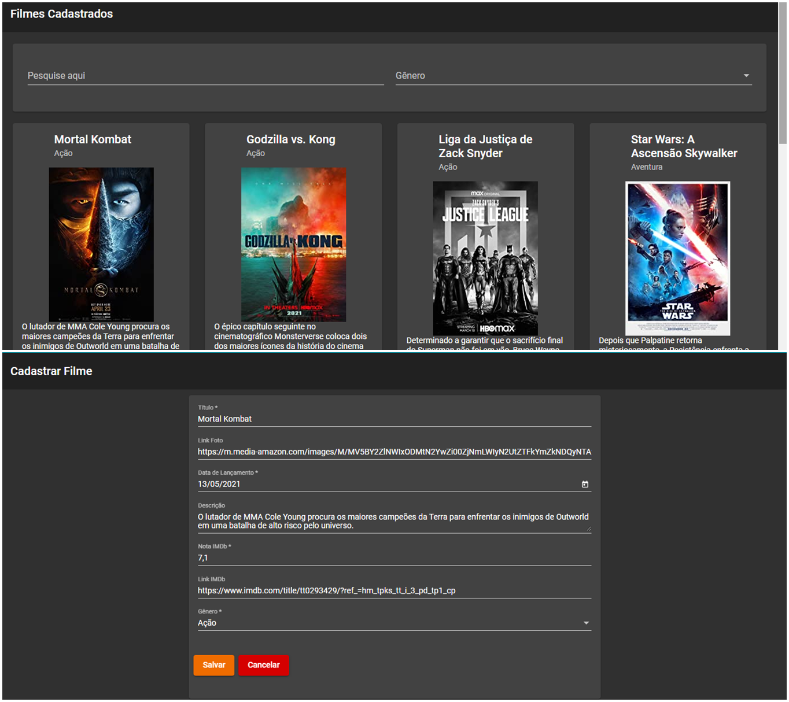

## :rocket: Técnicas avançadas em Angular 8

### :art: Layout

  

----------

### :link: Instalar Dependências

npm install

----------

### :shield: JSON Server

Instalação:
npm install -g json-server

Execução:
json-server --watch db.json

Obs: Se o projeto não possuir o arquivo "db.json" ele é criado automaticamente.

----------

### :computer: Servidor de Desenvolvimento

Execute npm start para compilar e executar o projeto na porta http://localhost:4200/.

----------

### :hammer_and_wrench: Ferramentas
As seguintes tecnologias foram utilizadas na construção do projeto:
- Angular Material;
- Biblioteca RxJS;
- Elvis Operator;
- Scroll Infinito - Paginação;
- JSON Server;
- HTML;
- CSS;
- TypeScript;
- Visual Studio Code.

----------

###  :gear: Função

- [x] CRUD de Filmes;

----------

###  :eyeglasses: Autor
José Gustavo da Silva.
 

